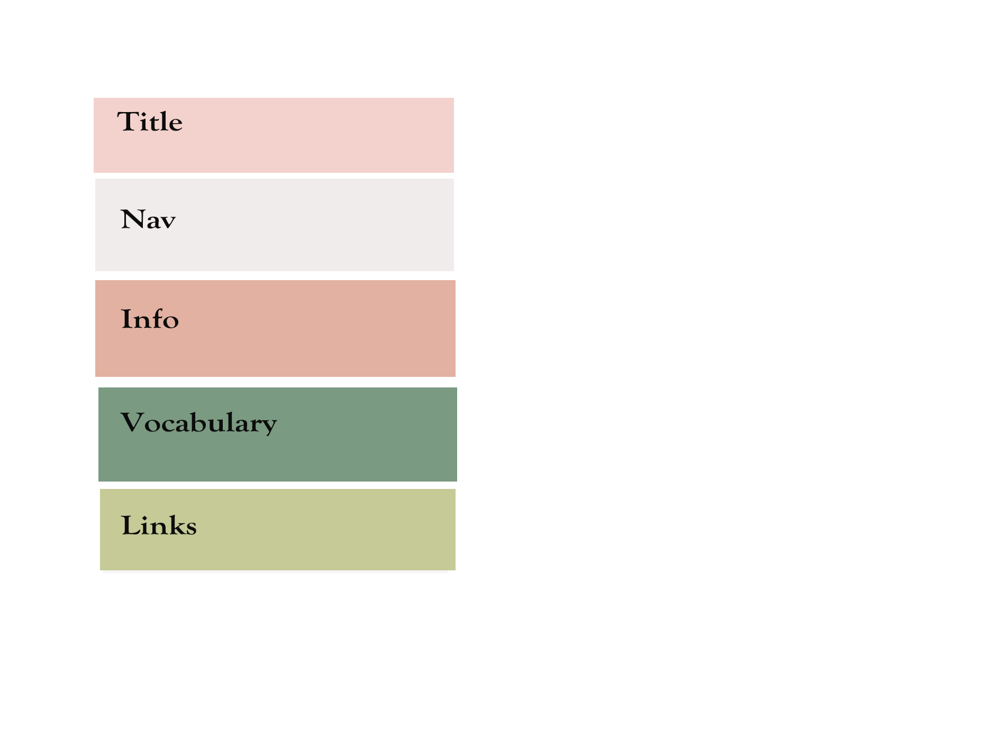
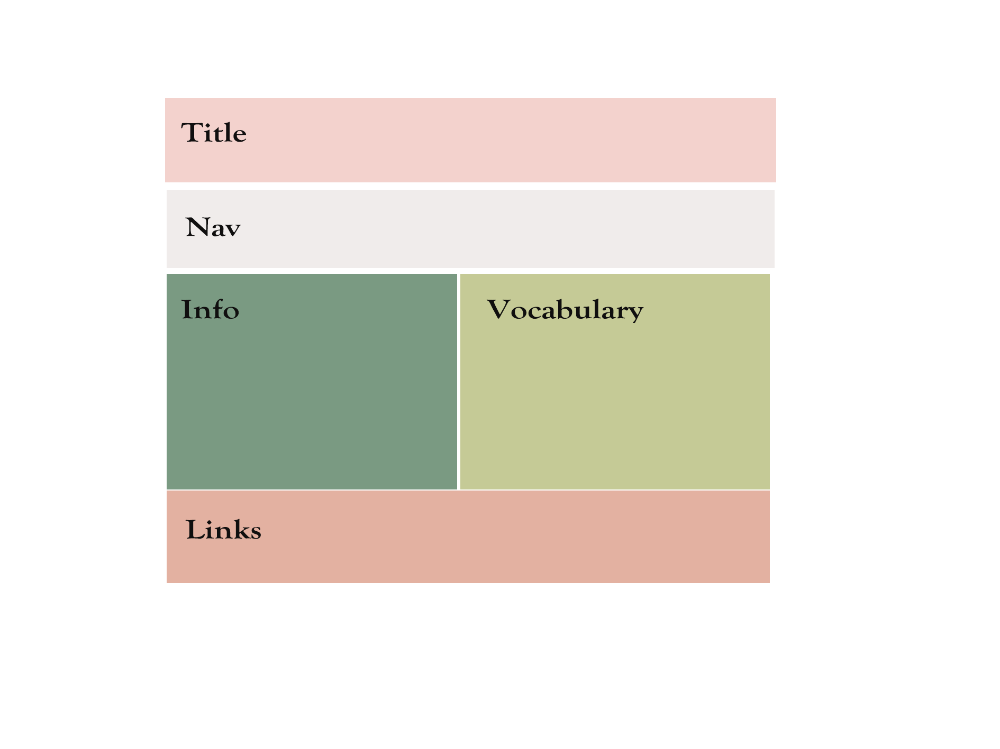

# Hyein Kang
## Week 10

<h4>
Overview
</h4>
What is the information this page aims to deliver?

: This page contains information about what Responsive Web Design is, why it is important, and the links to the specific information about it.

What is the first information on  the page that should draw the eye?

: The first information on the page that will draw the eye will be what the RWD is.

What is the primary content of the page?

:The primary content of the page is two boxes of what is RWD and why it's important.

What is the secondary content of the page?

:The secondary content is the links of specific information about RWD.

<h3>
Summary
</h3>
I had pretty hard time this week. I have no idea it will work or not after I run it. I hope it looks great!

<h4>
Wireframing
</h4>
I didn't go through exactly what I designed previously when I make the website. But it has similar ideas and color palette on it.

